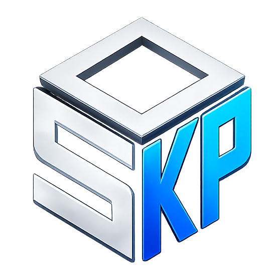
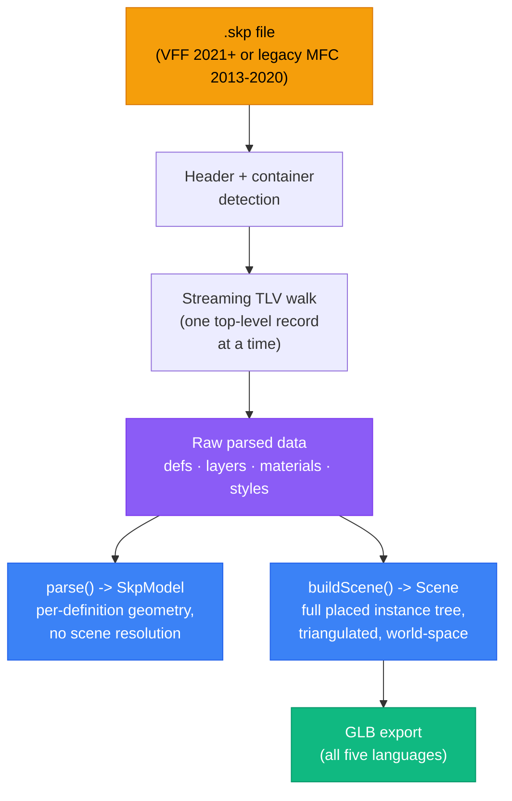

<div align="center">



### The Open-Source SketchUp File Toolkit

**Parse `.skp` files in five languages — and write them natively in Python. No SDK. No license. Just code.**

### 🏠 [openskp.com](https://openskp.com) · 🌐 [Try the Live Web Viewer (Drag-and-Drop)](https://iamahsanmehmood.github.io/openskp/) · 📖 [Browse the Docs Site](https://iamahsanmehmood.github.io/openskp/docs/)

[](https://opensource.org/licenses/MIT)
[](https://pypi.org/project/openskp/)
[](https://www.npmjs.com/package/openskp)
[](https://www.nuget.org/packages/OpenSkp)
[](https://pub.dev/packages/openskp)
[](https://github.com/iamahsanmehmood/openskp/releases?q=cpp-)
[](https://github.com/iamahsanmehmood/openskp)

---

*Open-source SketchUp binary file parser for Python, TypeScript, .NET, Dart, and C++ — plus a native `.skp` writer and editor in Python*

[Quick Start](#-quick-start) · [Features](#-features) · [Used in Production](#-used-in-production) · [Documentation](#-documentation) · [Contributing](#-contributing)

</div>

---

## 🌟 What is OpenSKP?

OpenSKP is the **first and only** open-source, cross-platform toolkit for SketchUp (`.skp`) binary files — built entirely through reverse engineering, with no SketchUp application or proprietary SDK required at any point.

**Reading** is available in **five languages** — Python, TypeScript, .NET, Dart, and C++ — parsing both the modern **VFF container** (2021+) and the classic **MFC `CArchive`** container (2013–2020) into full programmatic access: geometry, materials, components, layers, and more.

**Writing** is available in **Python**: a from-scratch legacy-format writer ([`openskp.create`](packages/python/src/openskp/create.py)) that produces real, editable geometry — materials and textures, layers, nested component definitions and groups, circular/arc curves, freeform polylines, faces with holes cut out — plus an editor ([`openskp.open_existing`](packages/python/src/openskp/edit.py)) that loads a file that already exists and extends it. Every writer feature is validated against the real SketchUp SDK, not just against this project's own reader, and it holds up rebuilding complex, real architectural models — not only synthetic test fixtures. Writing is Python-only today; porting it to the other four languages is a planned future direction, not yet under way — contributions toward that are very welcome.

> [!IMPORTANT]
> This project was built by reverse engineering a proprietary binary format. It is not affiliated with or endorsed by Trimble Inc. or SketchUp.

---

## ✨ Features

| Feature | Status | Description |
|:--------|:------:|:------------|
| **Parse SKP 2021+ (VFF)** | ✅ | Full support for the modern VFF binary container |
| **Parse SKP 2013–2020 (legacy MFC)** | ✅ | Full support for the classic MFC `CArchive` container — same output shape as VFF |
| **3D Geometry Extraction** | ✅ | Vertices, edges, faces, normals, and UV coordinates |
| **Component Hierarchy** | ✅ | Nested component definitions and instance transforms |
| **Scene Baking / Triangulation** | ✅ | Opt-in scene baking: full placed scene graph resolved to world-space, triangulated, GLB-ready — in all five languages |
| **Layers / Tags** | ✅ | Layer definitions with colors and visibility (`hidden` state) — fully exposed across all five languages |
| **Materials & Textures** | ✅ | Material properties, colors, transparency, colorized materials, and embedded texture images |
| **Styles** | ✅ | Front/back face colors for unpainted faces |
| **Dynamic Components** | ✅ | Extracts dynamic component attribute key-value pairs for both modern (2021+) and legacy (2013–2020) files, in all five languages |
| **Observability** | ✅ | Opt-in progress reporting + structured, location-carrying parse errors — see [docs/OBSERVABILITY.md](docs/OBSERVABILITY.md) |
| **Export to GLB / OBJ / STL / PLY / DXF 3D / IFC4 / JSON** | ✅ | GLB, Wavefront OBJ, STL, PLY, DXF 3D (AutoCAD Polyface Mesh), IFC4 (BIM), and JSON metadata export are available natively across all five languages — see [Export capabilities](docs/DEVELOPER_GUIDE.md#export-capabilities) |
| **Write native `.skp` files** | 🧪 Python only | Build new `.skp` files from scratch — geometry (including genuine circular/arc curves, freeform polylines, faces with holes cut out, and non-planar auto-triangulation), solid/textured materials, layers, nested component definitions and groups, instance rotation/visibility, and custom attribute dictionaries. No SDK involved — every feature validated against the real SketchUp SDK. See [`openskp.create`](packages/python/src/openskp/create.py) |
| **Edit existing `.skp` files** | 🧪 Python only | Load an existing legacy-format file and extend it — reuses its materials, layers, and component definitions, adds new geometry or instances, and saves a new file. See [`openskp.open_existing`](packages/python/src/openskp/edit.py) |
| **Streaming / low-memory parsing** | ✅ | Peak memory bounded by the largest single definition, not the whole file — see [Memory architecture](docs/ARCHITECTURE.md#memory-architecture) |
| **Pure Implementation** | ✅ | No SketchUp SDK, no native dependencies, no license required |
| **Cross-Platform** | ✅ | Works on Linux, macOS, and Windows |

---

## 🏭 Used in Production

OpenSKP isn't just a library — it's the SketchUp-parsing engine behind real, actively-used production applications:

| Project | Description | How it uses OpenSKP |
|:--------|:-------------|:---------------------|
|  [FrameSmart](https://frame-smart.com/) | A 3D collaboration platform for viewing, sharing, and collaborating on 3D models together with their metadata (IFC, SketchUp, and more) — hosted on Linux, with nearly 200 active users. | Powers FrameSmart's entire SketchUp import pipeline, end to end. |
| [IngeTrazo](https://ingetrazo.com/) | A free, Linux-first 3D modeler for civil engineering and architecture — a SketchUp alternative with a BIM → IFC bridge. | Replaced IngeTrazo's Wine + proprietary SketchUp DLL dependency as its native `.skp` import backend. |

Using OpenSKP in your own project? [Open an issue](https://github.com/iamahsanmehmood/openskp/issues) or a PR to add it here.

---

## 🖥️ Platform Support

| Platform | Version | Status | Install | Package Link |
|:---------|:--------|:------:|:--------|:-------------|
| 🐍 **Python** | [](https://pypi.org/project/openskp/) | ✅ Available | `pip install openskp` | [PyPI](https://pypi.org/project/openskp/) |
| 📘 **TypeScript / JS** | [](https://www.npmjs.com/package/openskp) | ✅ Available | `npm install openskp` | [npm](https://www.npmjs.com/package/openskp) |
| 🚀 **.NET / C#** | [](https://www.nuget.org/packages/OpenSkp) | ✅ Available | `dotnet add package OpenSkp` | [NuGet](https://www.nuget.org/packages/OpenSkp) |
| 🎯 **Dart / Flutter** | [](https://pub.dev/packages/openskp) | ✅ Available | `dart pub add openskp` | [pub.dev](https://pub.dev/packages/openskp) |
| ⚙️ **C++17** | [](https://github.com/iamahsanmehmood/openskp/releases?q=cpp-) | ✅ Source package | `find_package(OpenSkp CONFIG REQUIRED)` | [`packages/cpp`](packages/cpp) |

All five languages parse both the modern VFF (2021+) and classic MFC
(2013–2020) `.skp` containers, and support the same opt-in scene-baking
(`buildScene()`) and observability APIs. See the
[Developer Guide](docs/DEVELOPER_GUIDE.md) for the full picture, including
where the five ports currently differ.

---

## 🚀 Quick Start

Pick your language — every sample below runs against the current public
API (verified while writing this README). For the full picture (the
opt-in `buildScene()` step for triangulated meshes, memory/performance
guidance, progress + error observability, legacy-format support, and the
full writer/editor API), see the
**[Developer Guide](docs/DEVELOPER_GUIDE.md)**.

### 🐍 Python

```bash
pip install openskp
```

```python
from openskp import SkpFile

model = SkpFile.open("my_model.skp").parse()

print(f"SketchUp version: {model.version}")
print(f"Layers: {[l.name for l in model.layers]}")

for def_id, defn in model.definitions.items():
    print(f"{defn.name}: {len(defn.vertices)} verts, {len(defn.faces)} faces")

for material in model.materials:
    print(f"Material: {material.name}", "(has texture)" if material.texture else "")

# Opt-in: full placed scene graph, triangulated, world-space, GLB-ready
scene = SkpFile.open("my_model.skp").build_scene()
print(f"{len(scene.glb_primitives)} renderable mesh primitives")
```

🧪 **Writing** (Python-only):

```python
from openskp import create

builder = create()
red = builder.add_material("Red", (255, 0, 0))
with builder.add_component_definition("Chair") as chair:
    chair.add_face([(0, 0, 0), (20, 0, 0), (20, 20, 0), (0, 20, 0)])
builder.add_instance(chair, translation=(50, 0, 0))
builder.add_instance(chair, translation=(100, 0, 0), hidden=True)
builder.add_face([(0, 0, 0), (100, 0, 0), (100, 100, 0), (0, 100, 0)], material=red)
builder.save("output.skp")
```

And to extend a file that already exists rather than starting from
scratch, use `open_existing()` — see
[Editing an existing file](docs/DEVELOPER_GUIDE.md#editing-an-existing-file)
in the Developer Guide.

### 📘 TypeScript / JavaScript

```bash
npm install openskp
```

```typescript
import { SkpFile, toGLB } from 'openskp';

// Node.js
const model = SkpFile.open('my_model.skp').parse();

// Browser (isomorphic - same package, no Node APIs)
// const buffer = await fetch('my_model.skp').then(r => r.arrayBuffer());
// const model = parseSkp(buffer);

console.log(model.version, model.layers);

// Opt-in: full placed scene graph, triangulated, world-space, GLB-ready
const scene = SkpFile.open('my_model.skp').buildScene();
const glb = toGLB(scene);   // ready to write to a .glb file
```

### 🚀 .NET / C#

```bash
dotnet add package OpenSkp
```

```csharp
using OpenSkp;

var model = SkpFile.Open("my_model.skp");
Console.WriteLine($"{model.Version} - {model.Layers.Count} layers");

// Opt-in: full placed scene graph, triangulated, world-space, GLB-ready
var scene = SkpFile.BuildScene("my_model.skp");
Console.WriteLine($"{scene.GlbPrimitives.Count} renderable mesh primitives");

var glb = GlbExport.ToGlb(scene);       // ready to write to a .glb file
GlbExport.ExportGlb(scene, "my_model.glb");
IfcExport.ExportIfc(scene, "my_model.ifc");
```

### 🎯 Dart / Flutter

```bash
dart pub add openskp
```

```dart
import 'package:openskp/openskp.dart';

final model = SkpFile.open('my_model.skp').parse();
print('${model.version} - ${model.layers.length} layers');

// Opt-in: full placed scene graph, triangulated, world-space, GLB-ready
final scene = SkpFile.open('my_model.skp').buildScene();
print('${scene.glbPrimitives.length} renderable mesh primitives');

final glb = toGlb(scene);               // ready to write to a .glb file
exportGlb(scene, 'my_model.glb');
exportIfc(scene, 'my_model.ifc');
```

### ⚙️ C++17 / CMake

```cmake
find_package(OpenSkp CONFIG REQUIRED)
target_link_libraries(your_target PRIVATE OpenSkp::OpenSkp)
```

```cpp
#include <openskp/openskp.hpp>

auto skp = openskp::SkpFile::open("my_model.skp");
auto model = skp.parse();
auto scene = skp.build_scene();
auto glb = openskp::to_glb(scene);
openskp::export_glb(scene, "my_model.glb");
openskp::export_ifc(scene, "my_model.ifc");
```

---

## 🏛️ Architecture

OpenSKP splits into a light parse and an opt-in, heavier scene bake — kept
separate so the common case (just reading geometry/metadata) never pays for
scene-graph resolution it doesn't need:



The streaming TLV walk is what lets OpenSKP handle real production files
with 100,000+ component definitions without materializing the whole file's
parse tree in memory at once — peak memory is bounded by the single
largest top-level record, not the file's total size.

> 📖 For the full architecture breakdown — including the memory model,
> why .NET needed a genuinely different fix, and where the five languages'
> internals map to each other — see [docs/ARCHITECTURE.md](docs/ARCHITECTURE.md).

---

## 📁 Project Structure

```
openskp/
├── README.md                  # You are here
├── LICENSE                    # MIT License
├── CONTRIBUTING.md            # Contribution guide
├── CODE_OF_CONDUCT.md         # Contributor Covenant v2.1
├── CHANGELOG.md               # Release history
│
├── packages/
│   ├── python/                # 🐍 Python implementation — parse + write
│   │   ├── src/openskp/       # _core.py, legacy.py, model.py, scene.py, create.py, edit.py, ...
│   │   └── tests/
│   ├── typescript/            # 📘 TypeScript / JavaScript implementation
│   │   ├── src/                # index.ts, model.ts, legacy.ts, observability.ts, ...
│   │   └── tests/
│   ├── dotnet/                # 🚀 .NET / C# implementation
│   │   ├── OpenSkp/            # Core.cs, Legacy.cs, Model.cs, Scene.cs, ...
│   │   └── OpenSkp.Tests/
│   ├── dart/                  # 🎯 Dart / Flutter implementation
│   │   ├── lib/src/            # core.dart, legacy.dart, model.dart, scene.dart, ...
│   │   └── test/
│   └── cpp/                   # ⚙️ C++17 / CMake implementation
│       ├── include/openskp/    # Public API
│       ├── src/                # Parser and scene implementation
│       └── tests/
│
├── examples/
│   ├── web-viewer/             # Drag-and-drop 3D viewer (TypeScript + Three.js),
│   │                           # deployed live via GitHub Pages
│   └── python/                 # Python usage examples
│
├── docs/                       # 📖 Documentation
│   ├── DEVELOPER_GUIDE.md      # Start here — the detailed cross-language guide
│   ├── OBSERVABILITY.md        # Progress reporting + structured errors, in depth
│   ├── ARCHITECTURE.md         # Library architecture, memory model
│   ├── API_DESIGN.md           # Cross-platform API quick reference
│   └── BINARY_FORMAT.md        # Reverse-engineered SKP format spec
│
├── research/                   # 🔬 Research notes
│   └── METHODOLOGY.md          # Reverse engineering methodology
│
└── .github/
    ├── workflows/               # CI, per-language release, GitHub Pages deploy
    ├── PULL_REQUEST_TEMPLATE.md
    └── ISSUE_TEMPLATE/
```

---

## 🔬 How It Works

SketchUp `.skp` files use a proprietary binary format called **VFF** (introduced in SketchUp 2021). Here's how OpenSKP reads them:

### 1. Header Validation
Every SKP file starts with a magic marker (`FF FE FF 0E`) followed by a UTF-16LE version string. OpenSKP validates this header to confirm format compatibility.

### 2. ZIP Extraction
The SKP file is a ZIP archive (following the header). Inside, you'll find:
- **`model.dat`** — The binary geometry payload (TLV-encoded)
- **`materials/*/material.xml`** — Material definitions and textures
- **`meta/*.png`** — Thumbnails and preview images

### 3. TLV Parsing
The `model.dat` binary uses **Tag-Length-Value (TLV)** encoding:
- **Tag**: 2-byte identifier (little-endian)
- **Length**: 4-byte payload size (little-endian)
- **Value**: Raw bytes of the specified length

Some tags are *containers* — their payload is a sequence of nested TLV elements, forming a tree structure.

### 4. Model Construction
OpenSKP maps known tags to geometry primitives, component hierarchies, layers, and materials to build a structured, queryable model object.

### 5. Coordinate Conversion
SketchUp uses a **Z-up, inches** coordinate system. The same Y-up axis swap
applies everywhere in OpenSKP's output; only the unit scale differs by
context. For GLB vertex positions (Y-up, **meters**, per the glTF spec):

```
x_m =  x_inches × 0.0254
y_m =  z_inches × 0.0254
z_m = -y_inches × 0.0254
```

The scene graph's `position_mm` fields (`InstanceNode`/`MeshMetadata`) use
the same axis swap but **millimeters** (`× 25.4`) instead, since they're
metadata for placement/inspection rather than renderer-facing vertex data.

> 📖 The above covers the modern VFF (2021+) container. Pre-2021 files use a
> completely different container (a classic MFC `CArchive` object-graph
> stream, no ZIP involved) — OpenSKP detects and handles both
> transparently behind the same `parse()` call. See
> [the Developer Guide's legacy-format section](docs/DEVELOPER_GUIDE.md#legacy-format-support-sketchup-20132020)
> for details, and [docs/BINARY_FORMAT.md](docs/BINARY_FORMAT.md) for the
> full VFF/TLV specification.

---

## 📖 Documentation

### 🌐 [iamahsanmehmood.github.io/openskp/docs/](https://iamahsanmehmood.github.io/openskp/docs/)

A browsable docs site — install/quick-start per language, the data model, memory & performance numbers, observability, error handling, and the known differences between the five ports, all in one place. Deployed alongside the [web viewer](https://iamahsanmehmood.github.io/openskp/) from [`examples/web-viewer/docs/`](examples/web-viewer/docs/).

The full source for each topic also lives here as plain Markdown:

| Document | Description |
|:---------|:------------|
| [Developer Guide](docs/DEVELOPER_GUIDE.md) | **Start here.** The detailed, verified cross-language guide — API, memory/performance, legacy format, error handling, and known differences between the five ports |
| [Observability Guide](docs/OBSERVABILITY.md) | Progress reporting + structured errors, in depth |
| [Binary Format Spec](docs/BINARY_FORMAT.md) | Reverse-engineered VFF / TLV format documentation |
| [Architecture](docs/ARCHITECTURE.md) | Library design, memory model, and module structure |
| [API Design](docs/API_DESIGN.md) | Cross-platform API quick reference |
| [Research Methodology](research/METHODOLOGY.md) | How we reverse-engineered the format |
| [Changelog](CHANGELOG.md) | Version history and release notes |
| [Contributing](CONTRIBUTING.md) | How to contribute to OpenSKP |

---

## 🤝 Contributing

We welcome contributions from everyone! Whether it's fixing a bug, adding a feature, improving documentation, or implementing a new platform — every contribution matters.

```bash
# Clone the repository
git clone https://github.com/iamahsanmehmood/openskp.git
cd openskp

# Python
cd packages/python
python -m venv .venv
source .venv/bin/activate   # or .venv\Scripts\activate on Windows
pip install -e ".[dev]"
pytest

# TypeScript
cd packages/typescript
npm install
npm test

# .NET
cd packages/dotnet/OpenSkp.Tests
dotnet test

# Dart
cd packages/dart
dart pub get
dart test
```

Please read our [Contributing Guide](CONTRIBUTING.md) and [Code of Conduct](CODE_OF_CONDUCT.md) before submitting a pull request.

---

## 📄 License

OpenSKP is released under the [MIT License](LICENSE). You are free to use, modify, and distribute this software in both commercial and non-commercial projects.

---

## 🙏 Credits & Acknowledgements

**Created and maintained by [Ahsan Mehmood](https://github.com/iamahsanmehmood)**

This project would not be possible without:

- [Noor Ali Qureshi](https://github.com/nooraliqureshi) — SketchUp 2025 support, older SKP version fixes, materials rendering support, and the TypeScript UTF-8 decoding fix.
- [Marco Sumari](https://github.com/tuxiasumari) — material fidelity (textures, colourized materials, instance and back-side materials, per-face UV mapping), Image entities, styles, edge display flags, and full legacy MFC (SketchUp v8–v20) format support.
- [Thomas Loockx](https://github.com/thomasloockx) — the C++17 port, including the CMake package, cross-platform CI, and test suite.
- The open-source community for inspiration and feedback
- [Kaitai Struct](https://kaitai.io/) for binary format analysis patterns
- [glTF](https://www.khronos.org/gltf/) specification by Khronos Group
- Everyone who has contributed test files, bug reports, and code

---

<div align="center">

**⭐ If OpenSKP is useful to you, consider giving it a star on [GitHub](https://github.com/iamahsanmehmood/openskp)!**

Made with ❤️ by [Ahsan Mehmood](https://github.com/iamahsanmehmood)

</div>
