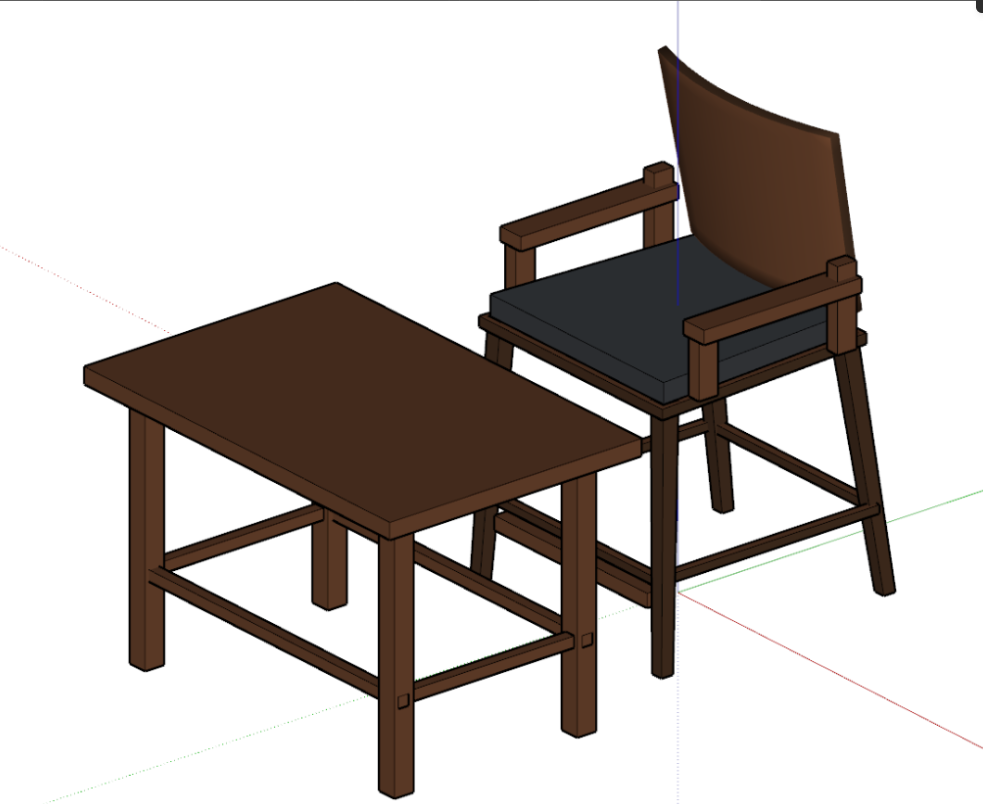
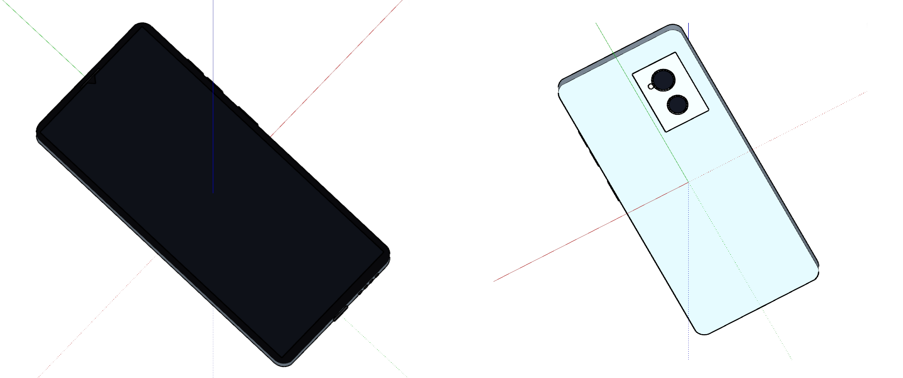
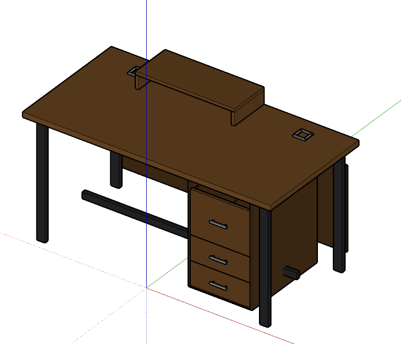

# AI-Generated SketchUp Models

OpenSKP's writer ([Write capabilities](DEVELOPER_GUIDE.md#write-capabilities))
turns out to be an unusually good target for AI coding agents — Claude
Code, Cursor, Windsurf, or any assistant that can read a well-documented
API and write code against it. This page is the evidence, and an open
invitation to build more on top of it.

## Why this works

Generating a 3D model with an LLM is normally a two-part problem: does
the model understand the *geometry* (vertex math, transforms, curve
tessellation), and does it understand the *target format*? OpenSKP
removes the second half entirely — an agent doesn't need to know
anything about SketchUp's binary format, class-ref/back-ref encoding, or
slot numbering. It just calls a generic, documented API
(`add_face`/`add_material`/`add_component_definition`/`add_instance`,
the same shape in every language — see
[Write capabilities](DEVELOPER_GUIDE.md#write-capabilities)) and the
writer handles the rest, with every feature independently validated
against the real SketchUp SDK.

No object-specific helper library is involved on purpose — no
`add_chair()` or `add_staircase()`. A raw, generic API is more work
per-call than a purpose-built primitives library would be, but it's also
strictly more general: an agent that already knows how to compose
vertices, materials, and component instances can build *anything* it can
describe, not just the shapes someone thought to pre-build a helper for.

## Proof, not a pitch

Real models, generated by AI coding agents from natural-language
prompts, using nothing but the raw `openskp.create()` API — no
primitives library, no hand-authored geometry. Two different AI agents
are represented here on purpose: the point isn't that one particular
assistant happens to be good at this, it's that a generic, well-documented
API is enough for *any* capable coding agent to work with.

### Generated by Claude

**Mid-century dining chair + accent table** — 9 component definitions,
38 meshes, 3 colored layers, 4 materials (Walnut, Oak, Charcoal Linen,
Brass). Demonstrates multiple materials on one part (top vs. side vs.
bottom face), reusable component definitions (4 identical legs
instanced, not hand-duplicated), a *nested* component definition (a
backrest assembly containing its own frame + cushion sub-parts), custom
attribute dictionaries, and genuine circular faces (brass foot glides) —
not polygon approximations.

```python
def add_frustum(scope, bottom_w, bottom_d, top_w, top_d, height,
                 side_material, top_material=None, bottom_material=None,
                 layer=None, z0=0.0):
    """A box that may taper between its bottom and top rectangle."""
    top_material = top_material if top_material is not None else side_material
    bottom_material = bottom_material if bottom_material is not None else side_material
    bw, bd, tw, td = bottom_w / 2.0, bottom_d / 2.0, top_w / 2.0, top_d / 2.0
    b = [(-bw, -bd, z0), (bw, -bd, z0), (bw, bd, z0), (-bw, bd, z0)]
    t = [(-tw, -td, z0 + height), (tw, -td, z0 + height), (tw, td, z0 + height), (-tw, td, z0 + height)]
    scope.add_face([b[0], b[3], b[2], b[1]], material=bottom_material, layer=layer)
    scope.add_face([t[0], t[1], t[2], t[3]], material=top_material, layer=layer)
    for i in range(4):
        j = (i + 1) % 4
        scope.add_face([b[i], b[j], t[j], t[i]], material=side_material, layer=layer)
```

This is a genuine excerpt, not a cherry-picked snippet — the agent wrote
its own small geometry-helper library (frustums, boxes) on top of the
raw `add_face` primitive, entirely unprompted, because that's the
natural way to compose the shapes it needed.

**Small gable cottage** — 1 top-level definition, 7 meshes, 3 layers, 6
materials including a translucent glass material. Rectangular
door/window openings cut via `holes=` (a real hole loop in the same
face, not a separate geometry hack), a genuine circular accent window
(`add_circle`), colored Walls/Roof layers, and a foundation + porch
step.

> **Screenshots pending for these two.** Both models were reviewed in
> real SketchUp during development and confirmed correct (clean
> materials, no geometry defects), but that review didn't leave behind
> saved image files. The source `.py`/`.skp`/`.glb` files these numbers
> come from are real and reproducible today.

### Generated by another AI agent (Antigravity)

The same raw API, used independently by a different AI coding agent,
producing three more models from natural-language and image prompts —
no shared code or prior knowledge of the first two:

<p align="center">
<br>
<em>An armchair + side table, with tapered/splayed legs and a curved, tessellated backrest.</em>
</p>

<p align="center">
<br>
<em>A smartphone modeled directly from a real product reference photo — waterdrop notch, dual camera module, front and back shown.</em>
</p>

<p align="center">
<br>
<em>An executive desk with a 3-drawer unit, cable-management cutouts, and a raised hutch — 8 nested component definitions.</em>
</p>

## Using this today

Point your AI coding agent at:

- [Write capabilities](DEVELOPER_GUIDE.md#write-capabilities) in the
  Developer Guide — the full writer API reference, in every language.
- Your language's package README (e.g.
  [`packages/python/README.md#writing`](../packages/python/README.md#writing))
  for a shorter, copy-pasteable starting point.
- A concrete goal in plain language — "build a dining chair with tapered
  legs and a curved backrest" works better than asking for SketchUp API
  calls directly, since the agent already knows how to turn a shape
  description into geometry once it has the writer's API in context.
- [`examples/python/lathe_and_extrude.py`](../examples/python/lathe_and_extrude.py)
  for turned/revolved shapes specifically (columns, vases, balusters,
  fountain tiers) — a `revolve()`/`extrude()` pair built entirely on the
  raw `add_face()`/`add_group()` API above, not a new writer capability.
  It exists because agents kept hand-rolling the same ~40-line
  ring-of-quads math per turned part; one call now does it. This is a
  narrow, deliberate exception to "no object-specific helpers" — it's a
  geometric primitive (a lathe), not a domain-specific one (`add_chair`
  is still out of scope) — contributed as a CC0 gift by
  [IngeTrazo](https://github.com/iamahsanmehmood) after the same pattern
  showed up repeatedly in their own AI Assistant's generated code.

The workflow that produced every showcase model above: describe the
object, let the agent write and run `openskp.create()` code, open the
result in
SketchUp (or view it via the [live web viewer](https://iamahsanmehmood.github.io/openskp/)
by exporting to GLB first) to check it, then iterate — including editing
an *existing* file with `open_existing()` rather than starting over, the
same way a human would keep refining a model rather than redrawing it
from scratch. When the agent can't execute code directly against a file
(a chat-only session, or handing off to another agent), `to_python_code()`
gives it the same starting point as text - a readable transcript of an
existing model's `create()` calls it can read, reason about, and extend,
rather than an opaque `.skp` binary. See
[Generating code from a file](DEVELOPER_GUIDE.md#generating-code-from-a-file).

## What's next — help build this out

This page documents what already works today: a generic, AI-legible
writer API, proven on real generated models. Two directions listed here
as open now have a real reference implementation, built by a downstream
project rather than in this repo:

- **A render/validate feedback loop.** The biggest gap in "AI generates
  a `.skp` file" is that the agent has no way to *see* what it built
  without a human opening SketchUp — closing that loop needs an actual
  3D viewport, which is out of scope for a library that only reads and
  writes files. [IngeTrazo](https://github.com/iamahsanmehmood), a
  desktop `.skp` editor built on this project's reader and writer, has
  shipped exactly this: an in-app AI Assistant that runs an agent's
  recipe against the live scene, screenshots the viewport, and feeds the
  image back for the next turn — closing the loop this page describes,
  just one layer up from OpenSKP itself.
- **An MCP server.** IngeTrazo also ships one (`docs/ai-bridge.md` in
  their repo) exposing the same recipe-execution engine to an external
  MCP client. Worth a look before building a second one from scratch.
- **More showcase models** — different shapes, different levels of
  geometric complexity, ideally with the prompt that produced them
  alongside the code and a real screenshot. IngeTrazo's own AI Assistant
  reproduced a real three-tier garden fountain from a single reference
  photo this way — 7 component definitions, 1,104 faces, correct
  real-world dimensions, using the `revolve()`/`extrude()` helpers above
  — a strong independent proof point for the writer API under real,
  unsupervised AI use.

Contributions and ideas on any of the above are welcome — see
[CONTRIBUTING.md](../CONTRIBUTING.md), or open a discussion on the
[issue tracker](https://github.com/iamahsanmehmood/openskp/issues).
