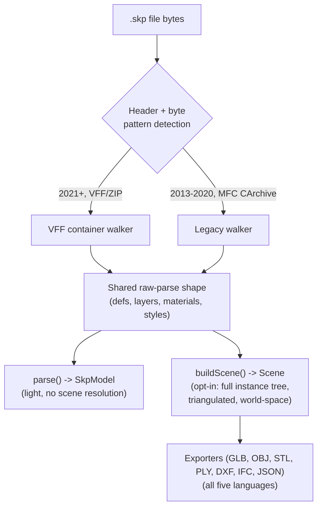
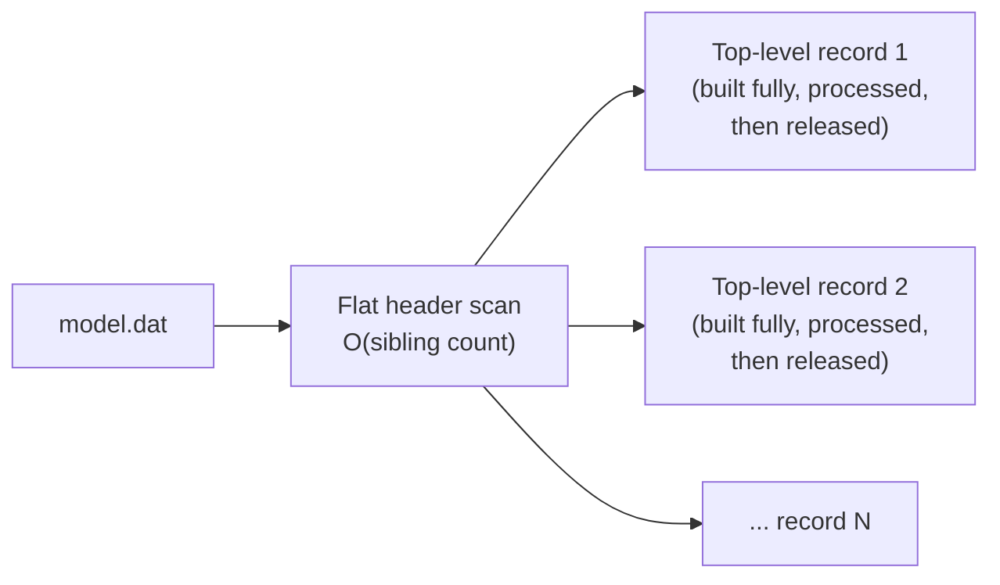

# Architecture

## Design principles

1. **One reverse-engineered specification, five independent implementations.**
   Python, TypeScript, .NET, Dart, and C++ each parse the same binary format
   from scratch in their own idiomatic style — not bindings around a shared
   native core. [BINARY_FORMAT.md](BINARY_FORMAT.md) is the one canonical
   reference all five are checked against.
2. **Zero SketchUp SDK.** Pure implementations, no proprietary dependencies,
   no license required.
3. **Two-tier API, split for memory, not just abstraction.** `parse()`
   (light, per-definition, no scene resolution) and `buildScene()`
   (opt-in, full placed scene graph, triangulated) are genuinely separate
   code paths — `buildScene()` re-parses independently rather than
   building on a prior `parse()` call, so a plain `parse()` never pays for
   the heavier work. See [DEVELOPER_GUIDE.md](DEVELOPER_GUIDE.md#two-entry-points-parse-and-buildscene).
4. **Streaming over materializing.** The whole file's TLV tree is never
   held in memory at once — see [Memory architecture](#memory-architecture)
   below. This is the single most consequential architectural decision in
   the codebase; real production files can have 100,000+ component
   definitions, and the naive "parse everything into one tree, then walk
   it" approach crashed outright on files in the hundreds-of-MB range.
5. **Cross-validated, not just cross-implemented.** Every non-trivial
   feature (materials, styles, legacy MFC support, scene-baking,
   triangulation, memory behavior) is checked against real `.skp` files
   and against the other three languages' output for the same file, not
   just unit-tested against synthetic fixtures.

## Two container eras, one output shape

SketchUp changed `.skp`'s container format in 2021. OpenSKP transparently
handles both:

**VFF path** (`core.*` / `_core.py`): validate the `FF FE FF 0E` header,
locate the embedded ZIP, extract `model.dat` plus material/style XML,
stream-walk `model.dat`'s top-level TLV records.

**Legacy path** (`legacy.*`): pre-2021 files are not ZIP containers at
all — after the same UTF-16 header records, the body is one uncompressed
MFC `CArchive` object-graph stream with a single global 1-based store map.
The legacy walker resolves that store map (including a bootstrap step to
locate the absolute slot base, since the pre-model region's classes are
walked opaquely) and adapts its output to the *same* shape the VFF path
produces, so everything downstream — `parse()`, `buildScene()`, error
handling, observability — is identical regardless of which walker ran.
See [DEVELOPER_GUIDE.md's legacy section](DEVELOPER_GUIDE.md#legacy-format-support-sketchup-20132020)
for what's specific to this format.

## Memory architecture

The change that made large real files (hundreds of MB, 100,000+
definitions) actually work, instead of crashing:

**Before:** parse the *entire* file into one TLV tree in memory (every
definition, every layer, every material — all of it, simultaneously),
*then* walk the tree to extract geometry. Peak memory scaled with the
whole file's total node count.

**After:** a cheap flat-header pre-scan (`_flat_headers`/`flatHeaders`/
`FlatHeaders`) finds each **top-level** record's (offset, size) — O(sibling
count), not O(total node count) — and `iter_top_level_lazy()` /
`iterTopLevelLazy()` / `IterTopLevelLazy()` yields one top-level record's
**fully-built** subtree at a time. The caller (the definitions/layers/
materials collection loop) processes it and drops the reference before the
next one is built, so it's eligible for garbage collection immediately.
Peak memory is bounded by the size of the **single largest** top-level
record — a huge component definition, say — not the file's total size.

This one change is what every language's memory fix is built on — the
per-tag extraction logic (every field, every tag's decoding) was **not
touched**; only the orchestration loop that decides how much of the tree
exists in memory at once changed. It's also what makes progress reporting
free: the flat header scan already knows the total record count, so
"N of total" needs no extra pass over the file (see
[OBSERVABILITY.md](OBSERVABILITY.md#granularity-why-500)).

### .NET's additional constraint

The CLR's array and `MemoryStream` types have a hard ~2.1 GB size ceiling
regardless of GC configuration. Since a decompressed `model.dat` can
legitimately exceed that (SketchUp's binary format commonly compresses at
~10x), the lazy-iteration fix alone wasn't sufficient for .NET — it also
needed `ChunkedBuffer` (a multi-segment byte buffer abstraction) and every
TLV offset widened from `int` to `long`. This is the one place where a
language's memory fix required an actual architecture addition beyond the
shared streaming-iteration change; see `packages/dotnet/OpenSkp/ChunkedBuffer.cs`.

### Where TypeScript's fix falls short

The lazy top-level iteration bounds the **walk's** peak memory in
TypeScript exactly like the other three languages. What it doesn't change
is the size of the **final** `SkpModel` result: for a file with millions
of vertices/edges/faces, that result is millions of small JS object
literals, and V8's per-object overhead makes that final result
significantly larger in memory than the equivalent Python tuples, .NET
structs, or Dart typed collections. See
[DEVELOPER_GUIDE.md's performance section](DEVELOPER_GUIDE.md#performance)
for verified numbers and current practical guidance; a more compact
internal representation is tracked as follow-up work.

## Module layout

Each language groups the same responsibilities, named idiomatically per
platform:

| Responsibility | Python | TypeScript | .NET | Dart | C++ |
|---|---|---|---|---|---|
| Raw parse orchestration | `_core.py` | `index.ts` | `Core.cs` | `core.dart` | `core.cpp` |
| Low-level TLV parsing / lazy iteration | `_core.py` | `parser.ts` | `Tlv.cs` | `tlv.dart` | `tlv.cpp` |
| VFF container | `vff.py` | `vff.ts` | `Vff.cs` | `vff.dart` | `vff.cpp` |
| Legacy MFC container | `legacy.py` | `legacy.ts` | `Legacy.cs` | `legacy.dart` | `legacy.cpp` |
| Geometry extraction | `_core.py` | `geometry.ts` | `Geometry.cs` | `geometry.dart` | `geometry.cpp` |
| Public model | `model.py` | `model.ts` | `Model.cs` | `model.dart` | `model.cpp` |
| Scene baking | `scene.py` | `model.ts` | `Scene.cs` | `scene.dart` | `scene.cpp` |
| Exporters (GLB, OBJ, STL, PLY, DXF, IFC, JSON) | `export/` | `obj.ts`, `stl.ts`, `ply.ts`, `dxf.ts`, `ifc.ts` | `GlbExport.cs`, `ObjExport.cs`, `StlExport.cs`, `PlyExport.cs`, `DxfExport.cs`, `IfcExport.cs`, `JsonExport.cs` | `glb_export.dart`, `obj_export.dart`, `stl_export.dart`, `ply_export.dart`, `dxf_export.dart`, `ifc_export.dart`, `json_export.dart` | `glb_export.cpp`, `obj_export.cpp`, `stl_export.cpp`, `ply_export.cpp`, `dxf_export.cpp`, `ifc_export.cpp`, `json_export.cpp` |
| Triangulation | `triangulator.py` | `triangulator.ts` | `Triangulator.cs` + `Earcut.cs` | `triangulator.dart` + `earcut.dart` | `triangulator.cpp` + `earcut.cpp` |
| Transform math | `transforms.py` | `transforms.ts` | `Transforms.cs` | `transforms.dart` | `transforms.cpp` |
| Errors / observability | `errors.py` / logging | `errors.ts` / `observability.ts` | `Errors.cs` / `Observability.cs` | `errors.dart` / `observability.dart` | `errors.cpp` / `observability.cpp` |
| Public entry point | `model.py` | `index.ts` | `Parser.cs` | `parser.dart` | `parser.cpp` |

Note Python has no dedicated `observability.py` — it's instrumented
directly at each call site using the standard-library `logging` module,
which needs no shared helper module the way the other three languages'
callback-based approach does. See
[OBSERVABILITY.md](OBSERVABILITY.md#per-language-mechanism) for why.

### Triangulation: not the same algorithm everywhere (by design, now)

Python originally used `shapely` (a full computational-geometry library,
Delaunay-style). TypeScript used [earcut](https://github.com/mapbox/earcut)
(Mapbox's compact, dependency-free ear-clipping algorithm with hole
support) from the start. When scene-baking was ported to .NET and Dart,
the natural instinct was to treat `shapely`'s Delaunay approach as "the"
reference — but reading TypeScript's actual `triangulator.ts` source
revealed it uses earcut, not Delaunay. `earcut` was ported faithfully
(same linked-list-node algorithm, function-by-function) to both C#
(`Earcut.cs`) and Dart (`earcut.dart`) instead of attempting an
independent Delaunay-equivalent — lower risk, and it's what TypeScript
had already proven correct on real files. Python's `triangulator.py`
still uses `shapely`; the two algorithms can legitimately produce
different (but each individually valid) triangulations of the same
polygon, which is expected and fine — the *rendered result* is
equivalent, not the internal triangle split.

## Cross-platform dependency map

| Component | Python | TypeScript | .NET | Dart | C++ |
|---|---|---|---|---|---|
| ZIP/VFF extraction | `zipfile` | `fflate` | `System.IO.Compression` | `archive` | private miniz 3.1.2 |
| XML parsing | `ElementTree` | manual/DOM | `System.Xml` | `xml` | focused scanner |
| Triangulation | `shapely` | `earcut` | ported earcut | ported earcut | native C++ |
| Matrix math | `numpy` | native | native | native | native |
| GLB/OBJ/STL/PLY/DXF/IFC/JSON export | all (native / `trimesh`) | all (native) | all (native) | all (native) | all (native + private TinyGLTF 2.9.7) |

## Testing philosophy

Every language's test suite includes at least one real, binary `.skp`
fixture (not just synthetic byte sequences) checked in under
`tests/fixtures/` (or the language's equivalent), with assertions on exact
face/edge/vertex counts, specific vertex coordinates, material names, and
bounding boxes — cross-validated against the other languages' output for
the *same file*. Beyond the checked-in small fixtures, larger real
production files (tens to hundreds of MB, sourced from actual SketchUp/BIM
workflows) are used for memory and performance verification but are not
committed to the repository.
